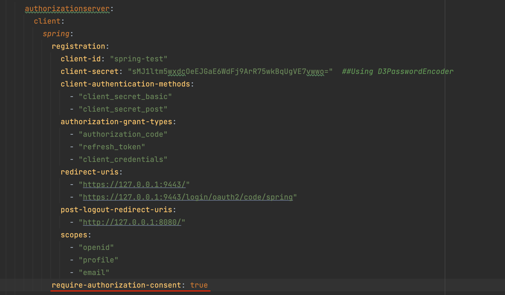

# spring-oauth2-server

Authorization server for OAuth2

RT: Refresh Token
AT: Access Token

Default RT life: 60min
Default AT life: 5min

Default AuthorizationGrantType:

1. authorization_code
2. refresh_token
3. client_credentials
4. password (ROPC deprecated)
5. JWT_BEARER (urn:ietf:params:oauth:grant-type:jwt-bearer)
6. DEVICE_CODE (urn:ietf:params:oauth:grant-type:device_code)

urn:ietf:params:oauth:grant-type:device_code is ACR
<b><i>DISCLAIMER:</b> This is POC code with scope of improvement.

This branch shows how we can use code flow from a client. With

1. Externalised the JWKs from resources
2. Custom password encoder
3. A service to fetch user (Principal) details from another service
4. Multiple JWT customizer based upon whom its being issued
5. A functional test on verify the code flow

Code flow in this POC include (
Refer [OAuthCodeFlowTest](src/test/java/org/d3softtech/oauth2/server/functionaltest/OAuthCodeFlowTest.java)):

1. Authorization flow initiation
2. User Login
3. User Consent
4. Introspection
5. Refresh
6. Revoke

### User Consent 
User consent is shown if:
1. Enabled on configuration.
2. If scope is not only openid i.e. it will not be displayed if scope is only openid
3. If Consent already done it will not be done again. 

To disable consent:
1. Use scope ``openid`` only
2. disable through configuration 
```yaml 
require-authorization-consent: true
```

### Revoke

Revoke endpoint will invalidate the token provided, but if the token is refresh_token then it will
invalidate access_token and authorization_code also if not already invalidated.

### Client Authentication

Client authentication can be done using different methods:

1. JWT - "client_secret_jwt"
2. Basic Auth Credentials - "client_secret_basic"
3. POST body form credentials - "client_secret_post"
4. PKCE - "none"

Client should be configured with allowed methods to support in OAuth server.

### NOTE: Run OAuth server to verify the test