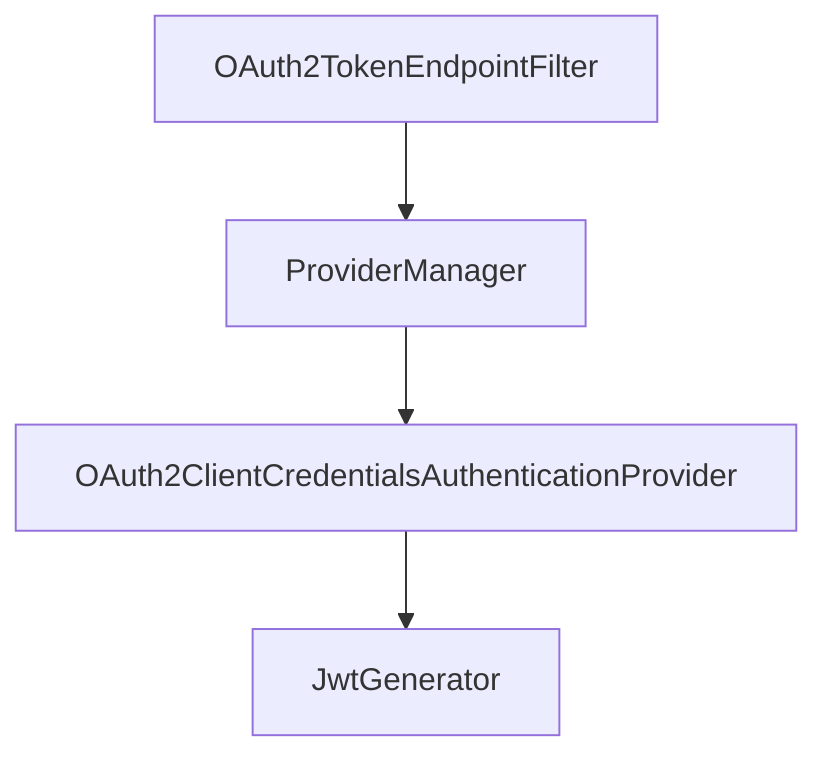

# spring-oauth2-server
Authorization server for OAuth2

### How JWT is created in /oauth2/token endpoint

```mermaid
graph TD;
    OAuth2TokenEndpointFilter-->ProviderManager-->OAuth2ClientCredentialsAuthenticationProvider-->JwtGenerator;
```

