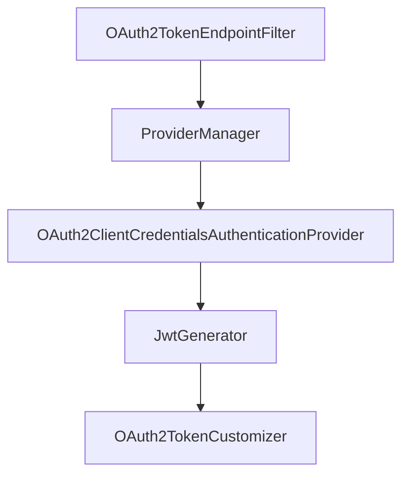

# spring-oauth2-server

Authorization server for OAuth2

This server is configured with custom OAuth2TokenCustomizer<JwtEncodingContext>, which is used to
customise the jwt token created using client-credential and code oauth flow.

Test class have example on how we can provide additional claims in request and get back in token.

#### How /oauth2/token endpoint works with Customizer

